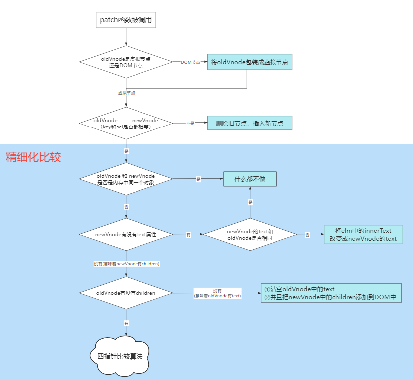
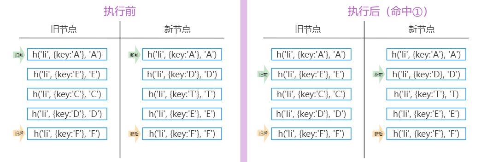
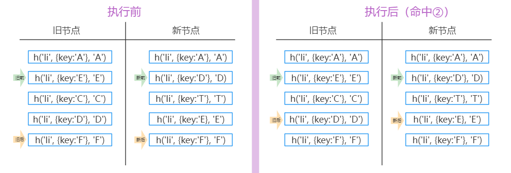
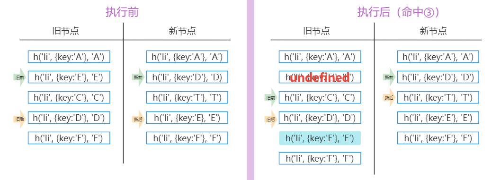

# 大纲
## 研究1： 虚拟DOM如何被渲染函数（h函数）产生？
## 研究2： diff算法原理
## 研究3： 虚拟DOM如何通过diff变成真正的DOM


### 1.虚拟DOM
用JS对象描述DOM的层次结构。DOM种的一切属性都在虚拟DOM中有对应的属性

### 2.diff是发生在虚拟DOM上的
新的虚拟DOM和老的虚拟DOM进行diff（精细化比较），算出应该如何最小量更新，最后反映到真实DOM上

### 3.h函数用来产生虚拟节点(vnode)
1. 调用h函数
```
h('a', { props: { href: 'http://www.baidu.com' }}, '百度')
```
2. 得到虚拟节点
```
{
  sel: 'a',
  data: {
    props: {
      href: 'http://www.baidu.com'
    }
  },
  text: '百度'
}
```
3. 表示真正的DOM
```
<a href="http://www.baidu.com">百度</a>
```  

### 虚拟节点的属性
```
{
  children: undefined,
  data： {}，
  elm: undefined, // 表示这个元素对应的真正的DOM节点， undefined表示这个节点还没有上树
  key: undefined, // 表示这个节点的唯一标识
  sel: 'a',
  text: '百度'
}
```

### h函数嵌套使用
1. h函数
  ```
  h('ul',{}, [
    h('li',{},'1'),
    h('li',{},'2'),
    h('li',{},'3'),
  ])
  ```
2. 虚拟DOM
  ```
  {
    sel: 'ul',
    data: {},
    children: [
      { sel: 'li', text: '1' },
      { sel: 'li', text: '2' },
      { sel: 'li', text: '3' },
    ]
  }
  ```

## diff算法
  1. key是服务于最小量更新。 key是这个节点的唯一标识，告诉diff算法，在更改前后它们是同一个DOM节点
  2. 只有是同一个虚拟节点，才进行精细化比较，否则就是暴力删除旧的，插入新的。
     延申问题： 如何定义同一个虚拟节点？  答： 选择器相同且key相同
  3. 只进行同层比较，不会进行跨层比较。 即使是同一片虚拟节点，但是跨层了，对不起，精细化比较就不diff你。而是暴力删除旧节点，插入新节点


### patch


### 经典的diff算法优化策略

四种命中查找：

① **新前与旧前** （命中时：新前与旧前指针均下移）



② **新后与旧后** （命中时：新后与旧后指针均上移）



③ **新后与旧前** （命中时：移动新前指向的这个节点到老节点的**旧后的后面**（所有未处理节点的最后面））



④ **新前与旧后** （命中时：移动新前指向的这个节点到老节点的**旧前的前面**）


   
**命中一种后就不再命中判断了**
**如果都没有命中，就需要用循环来寻找了**

名词注解：
`新`：新的虚拟节点（newVnode）
`旧`：旧的虚拟节点（oldVnode）
`前`：所有没有处理的开头的节点
`后`：所有没有处理的最后的节点

